## Banner Section

The Banner Section component displays a single, translatable line of rich text. It's designed to be used as a simple, full-width banner on a page.

Avaliable on Location templates.

---

### Props

The component's props are organized into categories for data, styling, and visibility.

#### Data Props

This object contains the content to be displayed by the component.

| Prop        | Type              | Description                                                                                   | Default                    |
| :---------- | :---------------- | :-------------------------------------------------------------------------------------------- | :------------------------- |
| `data.text` | `YextEntityField` | The rich text to display. It can be linked to a Yext entity field or set as a constant value. | `"Banner Text"` (constant) |

#### Style Props

This object contains properties for customizing the component's appearance.

| Prop                     | Type                                                           | Description                                   | Default              |
| :----------------------- | :------------------------------------------------------------- | :-------------------------------------------- | :------------------- |
| `styles.backgroundColor` | [`backgroundColor`](../utils/README.md#backgroundColorOptions) | The background color of the section.          | `Background Color 6` |
| `styles.textAlignment`   | `'left' \| 'right' \| 'center'`                                | The horizontal alignment of the text content. | `'center'`           |

#### Visibility Props

This property controls the component's visibility on the live page.

| Prop             | Type      | Description                                                                    | Default |
| :--------------- | :-------- | :----------------------------------------------------------------------------- | :------ |
| `liveVisibility` | `boolean` | If `true`, the component is visible on the live page; if `false`, it's hidden. | `true`  |

## Breadcrumbs Section

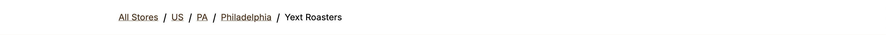

The Breadcrumbs component automatically generates and displays a navigational hierarchy based on a page's position within a Yext directory structure. It renders a list of links showing the path from the main directory root to the current page, helping users understand their location on the site.

Avaliable on Location templates.

---

### Props

The component's props are organized into categories for data, styling, and visibility.

#### Data Props

This object contains the content used by the component.

| Prop                 | Type                 | Description                                                                                  | Default            |
| :------------------- | :------------------- | :------------------------------------------------------------------------------------------- | :----------------- |
| `data.directoryRoot` | `TranslatableString` | The display label for the first link in the breadcrumb trail (the top-level directory page). | `"Directory Root"` |

#### Style Props

This object contains properties for customizing the component's appearance.

| Prop                     | Type                                                           | Description                          | Default              |
| :----------------------- | :------------------------------------------------------------- | :----------------------------------- | :------------------- |
| `styles.backgroundColor` | [`backgroundColor`](../utils/README.md#backgroundColorOptions) | The background color of the section. | `Background Color 1` |

#### Visibility Props

This property controls the component's visibility on the live page.

| Prop             | Type      | Description                                                                    | Default |
| :--------------- | :-------- | :----------------------------------------------------------------------------- | :------ |
| `liveVisibility` | `boolean` | If `true`, the component is visible on the live page; if `false`, it's hidden. | `true`  |

## Core Info Section

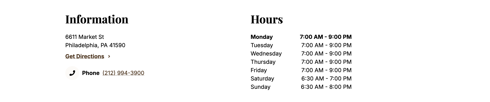

The Core Info Section is a comprehensive component designed to display essential business information in a clear, multi-column layout. It typically includes contact details (address, phone, email), hours of operation, and a list of services, with extensive options for customization.

Avaliable on Location templates.

---

### Props

The component's props are organized into categories for data, styling, and visibility.

#### Data Props

This object contains all the content to be displayed within the three columns.

| Prop                         | Type              | Description                                              | Default                    |
| :--------------------------- | :---------------- | :------------------------------------------------------- | :------------------------- |
| `data.info.headingText`      | `YextEntityField` | Heading for the "Information" column.                    | `"Information"` (constant) |
| `data.info.address`          | `YextEntityField` | The entity's physical address.                           | `address` field            |
| `data.info.phoneNumbers`     | `Array`           | A list of phone numbers, each with a number and a label. | `mainPhone` field          |
| `data.info.emails`           | `YextEntityField` | A list of email addresses.                               | `emails` field             |
| `data.hours.headingText`     | `YextEntityField` | Heading for the "Hours" column.                          | `"Hours"` (constant)       |
| `data.hours.hours`           | `YextEntityField` | The entity's hours of operation.                         | `hours` field              |
| `data.services.headingText`  | `YextEntityField` | Heading for the "Services" column.                       | `"Services"` (constant)    |
| `data.services.servicesList` | `YextEntityField` | A list of services offered by the entity.                | `services` field           |

#### Style Props

This object contains properties for customizing the component's appearance.

| Prop                                   | Type                                                           | Description                                                                  | Default              |
| :------------------------------------- | :------------------------------------------------------------- | :--------------------------------------------------------------------------- | :------------------- |
| `styles.heading.level`                 | [`headingLevel`](../utils/README.md#headingLevelOptions)       | The HTML heading level for column titles.                                    | `3`                  |
| `styles.heading.align`                 | `'left' \| 'center' \| 'right'`                                | The text alignment for all column headings.                                  | `'left'`             |
| `styles.backgroundColor`               | [`backgroundColor`](../utils/README.md#backgroundColorOptions) | The background color of the section.                                         | `Background Color 1` |
| `styles.info.showGetDirectionsLink`    | `boolean`                                                      | If `true`, displays a "Get Directions" link with the address.                | `true`               |
| `styles.info.phoneFormat`              | `'domestic' \| 'international'`                                | The formatting to apply to phone numbers.                                    | `'domestic'`         |
| `styles.info.includePhoneHyperlink`    | `boolean`                                                      | If `true`, wraps phone numbers in a clickable `tel:` hyperlink.              | `true`               |
| `styles.info.emailsListLength`         | `number`                                                       | The maximum number of emails to display from the list.                       | `1`                  |
| `styles.hours.startOfWeek`             | `string`                                                       | Sets the first day to display in the hours list.                             | `'today'`            |
| `styles.hours.collapseDays`            | `boolean`                                                      | If `true`, groups consecutive days with identical hours (e.g., "Mon - Fri"). | `false`              |
| `styles.hours.showAdditionalHoursText` | `boolean`                                                      | If `true`, shows supplementary text for holidays or future hours.            | `true`               |

#### Visibility Props

This property controls the component's visibility on the live page.

| Prop             | Type      | Description                                                                    | Default |
| :--------------- | :-------- | :----------------------------------------------------------------------------- | :------ |
| `liveVisibility` | `boolean` | If `true`, the component is visible on the live page; if `false`, it's hidden. | `true`  |

## Directory Page

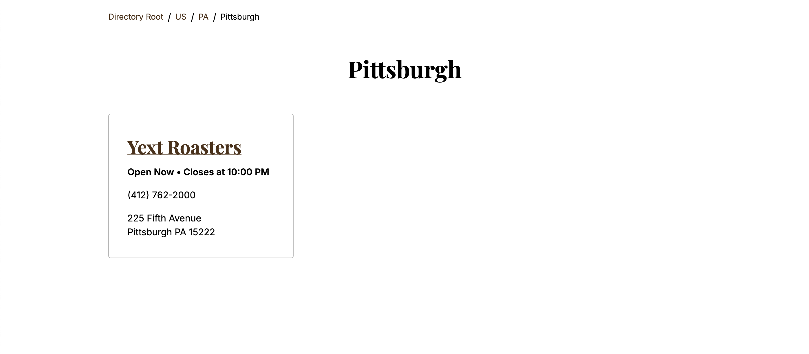

The Directory Page component serves as a navigational hub, displaying a list of child entities within a hierarchical structure (e.g., a list of states in a country, or cities in a state). It includes breadcrumbs for easy navigation and renders each child item as a distinct card.

Avaliable on Directory templates.

---

### Props

The component's props are organized into categories for data and styling.

#### Data Props

This object contains the content needed to configure the directory.

| Prop                 | Type                 | Description                                                        | Default                       |
| :------------------- | :------------------- | :----------------------------------------------------------------- | :---------------------------- |
| `data.directoryRoot` | `TranslatableString` | The display label for the root link in the breadcrumbs navigation. | `"Directory Root"` (constant) |

#### Style Props

This object contains properties for customizing the component's appearance.

| Prop                                | Type                                                           | Description                                                             | Default              |
| :---------------------------------- | :------------------------------------------------------------- | :---------------------------------------------------------------------- | :------------------- |
| `styles.backgroundColor`            | [`backgroundColor`](../utils/README.md#backgroundColorOptions) | The main background color for the directory page content.               | `Background Color 1` |
| `styles.breadcrumbsBackgroundColor` | [`backgroundColor`](../utils/README.md#backgroundColorOptions) | A specific background color for the breadcrumbs navigation bar.         | `Background Color 1` |
| `styles.cards.headingLevel`         | [`headingLevel`](../utils/README.md#headingLevelOptions)       | The HTML heading level for the title on each individual directory card. | `3`                  |
| `styles.cards.backgroundColor`      | [`backgroundColor`](../utils/README.md#backgroundColorOptions) | The background color for each individual directory card.                | `Background Color 1` |

## Events Section

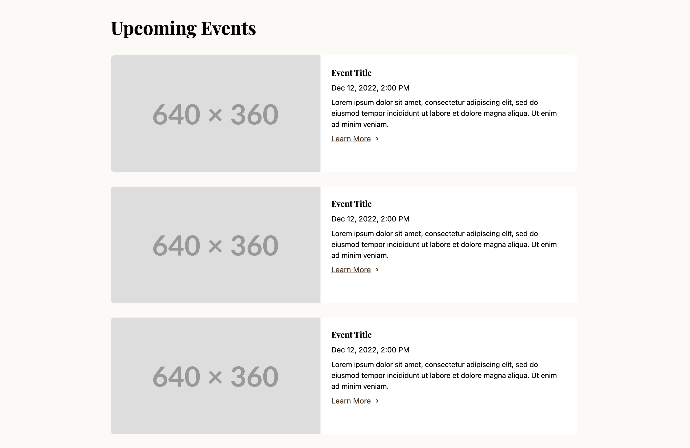

The Events Section component is designed to display a curated list of events. It features a prominent section heading and renders each event as an individual card, making it ideal for showcasing upcoming activities, workshops, or promotions.

Avaliable on Location templates.

---

### Props

The component's props are organized into categories for data, styling, and visibility.

#### Data Props

This object contains the content to be displayed by the component.

| Prop           | Type              | Description                                                                                    | Default                         |
| :------------- | :---------------- | :--------------------------------------------------------------------------------------------- | :------------------------------ |
| `data.heading` | `YextEntityField` | The main heading for the entire events section.                                                | `"Upcoming Events"` (constant)  |
| `data.events`  | `YextEntityField` | The source of event data, which can be linked to a Yext field or provided as a constant value. | A list of 3 placeholder events. |

#### Style Props

This object contains properties for customizing the component's appearance.

| Prop                           | Type                                                           | Description                                                               | Default              |
| :----------------------------- | :------------------------------------------------------------- | :------------------------------------------------------------------------ | :------------------- |
| `styles.backgroundColor`       | [`backgroundColor`](../utils/README.md#backgroundColorOptions) | The background color of the section.                                      | `Background Color 3` |
| `styles.heading.level`         | [`headingLevel`](../utils/README.md#headingLevelOptions)       | The HTML heading level (e.g., `2` for `<h2>`) for the main section title. | `2`                  |
| `styles.heading.align`         | `'left' \| 'center' \| 'right'`                                | The text alignment for the main section heading.                          | `'left'`             |
| `styles.cards.headingLevel`    | [`headingLevel`](../utils/README.md#headingLevelOptions)       | The HTML heading level for the title _within_ each individual event card. | `3`                  |
| `styles.cards.backgroundColor` | [`backgroundColor`](../utils/README.md#backgroundColorOptions) | The background color for each individual event card.                      | `Background Color 1` |

#### Visibility Props

This property controls the component's visibility on the live page.

| Prop             | Type      | Description                                                                    | Default |
| :--------------- | :-------- | :----------------------------------------------------------------------------- | :------ |
| `liveVisibility` | `boolean` | If `true`, the component is visible on the live page; if `false`, it's hidden. | `true`  |

## FAQ Section

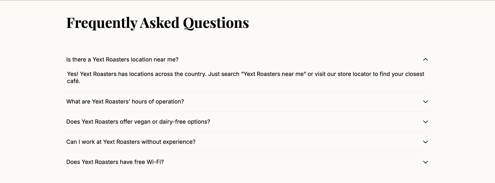

The FAQ Section component displays a list of questions and answers in an organized format. It includes a main heading for the section and typically renders the FAQs as an accordion, where users can click on a question to reveal the answer.

Avaliable on Location templates.

---

### Props

The component's props are organized into categories for data, styling, and visibility.

#### Data Props

This object contains the content to be displayed by the component.

| Prop           | Type              | Description                                                                                                        | Default                                   |
| :------------- | :---------------- | :----------------------------------------------------------------------------------------------------------------- | :---------------------------------------- |
| `data.heading` | `YextEntityField` | The main heading for the entire FAQ section.                                                                       | `"Frequently Asked Questions"` (constant) |
| `data.faqs`    | `YextEntityField` | The source of the FAQ data (questions and answers), which can be linked to a Yext field or provided as a constant. | A list of 3 placeholder FAQs.             |

#### Style Props

This object contains properties for customizing the component's appearance.

| Prop                     | Type                                                           | Description                                                               | Default              |
| :----------------------- | :------------------------------------------------------------- | :------------------------------------------------------------------------ | :------------------- |
| `styles.backgroundColor` | [`backgroundColor`](../utils/README.md#backgroundColorOptions) | The background color for the entire section.                              | `Background Color 2` |
| `styles.heading.level`   | [`headingLevel`](../utils/README.md#headingLevelOptions)       | The HTML heading level (e.g., `2` for `<h2>`) for the main section title. | `2`                  |
| `styles.heading.align`   | `'left' \| 'center' \| 'right'`                                | The text alignment for the main section heading.                          | `'left'`             |

#### Visibility Props

This property controls the component's visibility on the live page.

| Prop             | Type      | Description                                                                    | Default |
| :--------------- | :-------- | :----------------------------------------------------------------------------- | :------ |
| `liveVisibility` | `boolean` | If `true`, the component is visible on the live page; if `false`, it's hidden. | `true`  |

## Hero Section

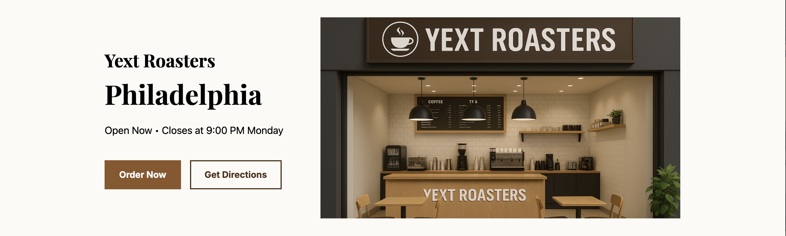

The Hero Section is a prominent, customizable banner typically placed at the top of a page. It's designed to be the main focal point, featuring key business information like name and hours, a large image, and primary calls-to-action to immediately engage visitors.

Avaliable on Location templates.

---

### Props

The component's props are organized into categories for data, styling, and visibility.

#### Data Props

This object contains the core content to be displayed in the hero.

| Prop                     | Type                    | Description                                                                             | Default                      |
| :----------------------- | :---------------------- | :-------------------------------------------------------------------------------------- | :--------------------------- |
| `data.businessName`      | `YextEntityField`       | The primary business name displayed in the hero.                                        | `"Business Name"` (constant) |
| `data.localGeoModifier`  | `YextEntityField`       | A location-based modifier or slogan (e.g., "Serving Downtown").                         | `"Geomodifier"` (constant)   |
| `data.hours`             | `YextEntityField`       | The entity's hours data, used to display an "Open/Closed" status.                       | `hours` field                |
| `data.hero`              | `YextStructEntityField` | The main hero content, including an image and primary/secondary call-to-action buttons. | Placeholder image and CTAs   |
| `data.showAverageReview` | `boolean`               | If `true`, displays the entity's average review rating.                                 | `true`                       |

#### Style Props

This object contains properties for customizing the component's appearance.

| Prop                           | Type                                                           | Description                                                       | Default                 |
| :----------------------------- | :------------------------------------------------------------- | :---------------------------------------------------------------- | :---------------------- |
| `styles.backgroundColor`       | [`backgroundColor`](../utils/README.md#backgroundColorOptions) | The background color for the entire section.                      | `Background Color 1`    |
| `styles.imageOrientation`      | `'left' \| 'right'`                                            | Positions the image to the left or right of the text content.     | `'right'`               |
| `styles.businessNameLevel`     | [`headingLevel`](../utils/README.md#headingLevelOptions)       | The HTML heading level for the business name.                     | `3`                     |
| `styles.localGeoModifierLevel` | [`headingLevel`](../utils/README.md#headingLevelOptions)       | The HTML heading level for the local geo-modifier.                | `1`                     |
| `styles.primaryCTA`            | [`ctaVariant`](../utils/README.md#ctaVariantOptions)           | The visual style variant for the primary call-to-action button.   | `'primary'`             |
| `styles.secondaryCTA`          | [`ctaVariant`](../utils/README.md#ctaVariantOptions)           | The visual style variant for the secondary call-to-action button. | `'secondary'`           |
| `styles.image`                 | `object`                                                       | Styling options for the hero image, such as aspect ratio.         | `{ aspectRatio: 1.78 }` |

#### Visibility Props

This property controls the component's visibility on the live, published page.

| Prop             | Type                 | Description                                                                    | Default |
| :--------------- | :------------------- | :----------------------------------------------------------------------------- | :------ |
| `liveVisibility` | `boolean` (optional) | If `true`, the component is visible on the live page; if `false`, it's hidden. | `true`  |

## Insight Section

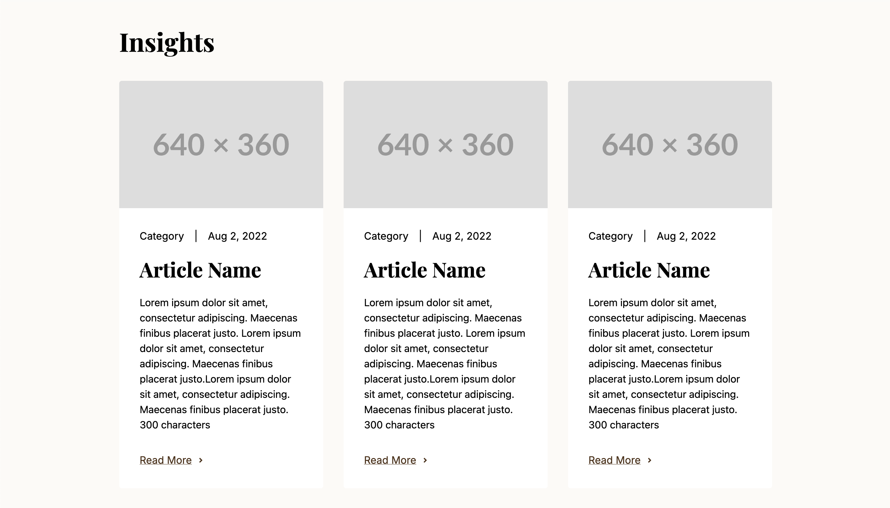

The Insight Section is used to display a curated list of content such as articles, blog posts, or other informational blurbs. It features a main section heading and renders each insight as a distinct card, making it an effective way to showcase valuable content.

Avaliable on Location templates.

---

### Props

The component's props are organized into categories for data, styling, and visibility.

#### Data Props

This object contains the content to be displayed by the component.

| Prop            | Type              | Description                                                                                    | Default                           |
| :-------------- | :---------------- | :--------------------------------------------------------------------------------------------- | :-------------------------------- |
| `data.heading`  | `YextEntityField` | The main heading for the entire insights section.                                              | "Insights"                        |
| `data.insights` | `YextEntityField` | The source of the insight data, which can be linked to a Yext field or provided as a constant. | A list of 3 placeholder insights. |

#### Style Props

This object contains properties for customizing the component's appearance.

| Prop                           | Type                                                     | Description                                                                 | Default                              |
| :----------------------------- | :------------------------------------------------------- | :-------------------------------------------------------------------------- | :----------------------------------- |
| `styles.backgroundColor`       | `string`                                                 | The background color for the entire section, selected from the theme.       | `backgroundColors.background2.value` |
| `styles.heading.level`         | [`headingLevel`](../utils/README.md#headingLevelOptions) | The HTML heading level (e.g., `3` for `<h3>`) for the main section title.   | `3`                                  |
| `styles.heading.align`         | `'left' \| 'center' \| 'right'`                          | The text alignment for the main section heading.                            | `'left'`                             |
| `styles.cards.headingLevel`    | [`headingLevel`](../utils/README.md#headingLevelOptions) | The HTML heading level for the title _within_ each individual insight card. | `4`                                  |
| `styles.cards.backgroundColor` | `string`                                                 | The background color for each individual insight card.                      | `backgroundColors.background1.value` |

#### Visibility Props

This property controls the component's visibility on the live page.

| Prop             | Type      | Description                                                                    | Default |
| :--------------- | :-------- | :----------------------------------------------------------------------------- | :------ |
| `liveVisibility` | `boolean` | If `true`, the component is visible on the live page; if `false`, it's hidden. | `true`  |

## Nearby Locations Section

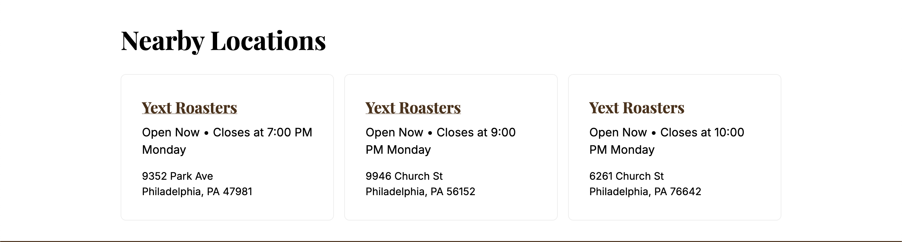

The Nearby Locations Section dynamically finds and displays a list of business locations within a specified radius of a central point. It's a powerful tool for helping users discover other relevant locations, rendering each result as a detailed card with contact information and business hours.

Avaliable on Location templates.

---

### Props

The component's props are organized into categories for data, styling, and visibility.

#### Data Props

This object defines the search parameters for finding nearby locations.

| Prop              | Type              | Description                                                      | Default                         |
| :---------------- | :---------------- | :--------------------------------------------------------------- | :------------------------------ |
| `data.heading`    | `YextEntityField` | The main heading for the entire section.                         | `"Nearby Locations"` (constant) |
| `data.coordinate` | `YextEntityField` | The central coordinate (`latitude`, `longitude`) to search from. | `yextDisplayCoordinate` field   |
| `data.radius`     | `number`          | The search radius in miles.                                      | `10`                            |
| `data.limit`      | `number`          | The maximum number of locations to find and display.             | `3`                             |

#### Style Props

This object contains extensive properties for customizing the component's appearance.

| Prop                             | Type                                                           | Description                                                               | Default              |
| :------------------------------- | :------------------------------------------------------------- | :------------------------------------------------------------------------ | :------------------- |
| `styles.backgroundColor`         | [`backgroundColor`](../utils/README.md#backgroundColorOptions) | The background color for the entire section.                              | `Background Color 1` |
| `styles.heading.level`           | [`headingLevel`](../utils/README.md#headingLevelOptions)       | The HTML heading level for the main section title.                        | `2`                  |
| `styles.heading.align`           | `'left' \| 'center' \| 'right'`                                | The text alignment for the main section heading.                          | `'left'`             |
| `styles.cards.headingLevel`      | [`headingLevel`](../utils/README.md#headingLevelOptions)       | The HTML heading level for the name on each location card.                | `3`                  |
| `styles.cards.backgroundColor`   | [`backgroundColor`](../utils/README.md#backgroundColorOptions) | The background color for each individual location card.                   | `Background Color 1` |
| `styles.phoneNumberFormat`       | `'domestic' \| 'international'`                                | The display format for phone numbers on the cards.                        | `'domestic'`         |
| `styles.phoneNumberLink`         | `boolean`                                                      | If `true`, wraps phone numbers in a clickable `tel:` hyperlink.           | `false`              |
| `styles.hours.showCurrentStatus` | `boolean`                                                      | If `true`, shows the current "Open" or "Closed" status for each location. | `true`               |
| `styles.hours.timeFormat`        | `'12h' \| '24h'`                                               | The time format for displaying business hours.                            | `'12h'`              |
| `styles.hours.showDayNames`      | `boolean`                                                      | If `true`, shows the names of the days of the week in the hours display.  | `true`               |
| `styles.hours.dayOfWeekFormat`   | `'short' \| 'long'`                                            | The format for the day names (e.g., "Mon" vs. "Monday").                  | `'long'`             |

#### Visibility Props

This property controls the component's visibility on the live page.

| Prop             | Type      | Description                                                                    | Default |
| :--------------- | :-------- | :----------------------------------------------------------------------------- | :------ |
| `liveVisibility` | `boolean` | If `true`, the component is visible on the live page; if `false`, it's hidden. | `true`  |

## Photo Gallery Section

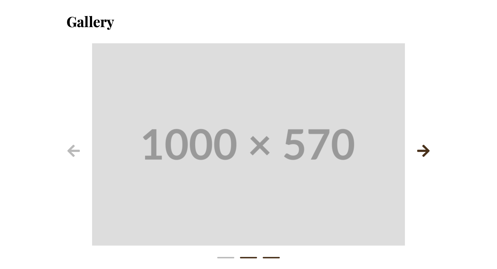

The Photo Gallery Section is designed to display a collection of images in a visually appealing format. It consists of a main heading for the section and a flexible grid of images, with options for styling the image presentation.

Avaliable on Location templates.

---

### Props

The component's props are organized into categories for data, styling, and visibility.

#### Data Props

This object contains the content to be displayed by the component.

| Prop           | Type              | Description                                                                                  | Default                         |
| :------------- | :---------------- | :------------------------------------------------------------------------------------------- | :------------------------------ |
| `data.heading` | `YextEntityField` | The main heading for the photo gallery.                                                      | `"Gallery"` (constant)          |
| `data.images`  | `YextEntityField` | The source of the image data, which can be linked to a Yext field or provided as a constant. | A list of 3 placeholder images. |

#### Style Props

This object contains properties for customizing the component's appearance.

| Prop                     | Type                                                           | Description                                                               | Default                 |
| :----------------------- | :------------------------------------------------------------- | :------------------------------------------------------------------------ | :---------------------- |
| `styles.backgroundColor` | [`backgroundColor`](../utils/README.md#backgroundColorOptions) | The background color for the entire section, selected from the theme.     | `Background Color 1`    |
| `styles.heading.level`   | [`headingLevel`](../utils/README.md#headingLevelOptions)       | The HTML heading level (e.g., `2` for `<h2>`) for the main section title. | `2`                     |
| `styles.heading.align`   | `'left' \| 'center' \| 'right'`                                | The text alignment for the main section heading.                          | `'left'`                |
| `styles.image`           | `object`                                                       | Styling options for the gallery images, such as aspect ratio.             | `{ aspectRatio: 1.78 }` |

#### Visibility Props

This property controls the component's visibility on the live page.

| Prop             | Type      | Description                                                                    | Default |
| :--------------- | :-------- | :----------------------------------------------------------------------------- | :------ |
| `liveVisibility` | `boolean` | If `true`, the component is visible on the live page; if `false`, it's hidden. | `true`  |

## Product Section

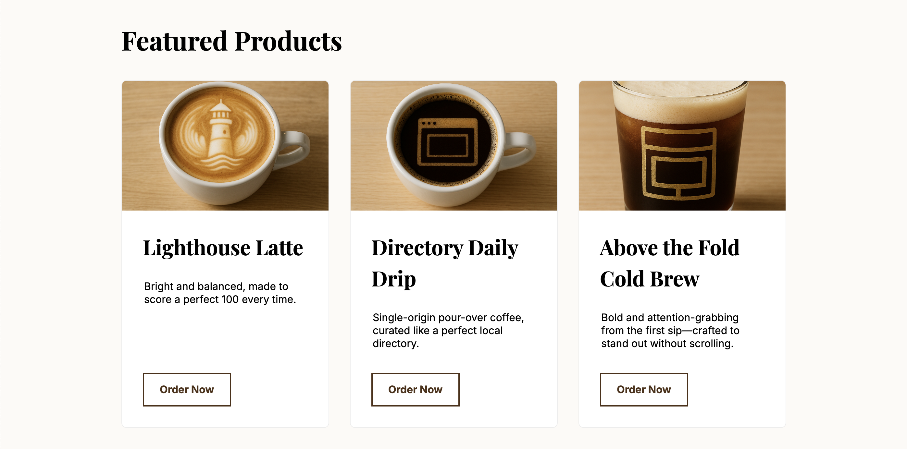

The Product Section is used to display a curated list of products in a dedicated section. It features a main heading and renders each product as an individual card, making it ideal for showcasing featured items, new arrivals, or bestsellers.

Avaliable on Location templates.

---

### Props

The component's props are organized into categories for data, styling, and visibility.

#### Data Props

This object contains the content to be displayed by the component.

| Prop            | Type              | Description                                                                                    | Default                           |
| :-------------- | :---------------- | :--------------------------------------------------------------------------------------------- | :-------------------------------- |
| `data.heading`  | `YextEntityField` | The main heading for the entire products section.                                              | `"Featured Products"` (constant)  |
| `data.products` | `YextEntityField` | The source of the product data, which can be linked to a Yext field or provided as a constant. | A list of 3 placeholder products. |

#### Style Props

This object contains properties for customizing the component's appearance.

| Prop                           | Type                                                           | Description                                                               | Default              |
| :----------------------------- | :------------------------------------------------------------- | :------------------------------------------------------------------------ | :------------------- |
| `styles.backgroundColor`       | [`backgroundColor`](../utils/README.md#backgroundColorOptions) | The background color for the entire section.                              | `Background Color 2` |
| `styles.heading.level`         | [`headingLevel`](../utils/README.md#headingLevelOptions)       | The HTML heading level (e.g., `2` for `<h2>`) for the main section title. | `2`                  |
| `styles.heading.align`         | `'left' \| 'center' \| 'right'`                                | The text alignment for the main section heading.                          | `'left'`             |
| `styles.cards.headingLevel`    | [`headingLevel`](../utils/README.md#headingLevelOptions)       | The HTML heading level for the name on each individual product card.      | `3`                  |
| `styles.cards.backgroundColor` | [`backgroundColor`](../utils/README.md#backgroundColorOptions) | The background color for each individual product card.                    | `Background Color 1` |

#### Visibility Props

This property controls the component's visibility on the live page.

| Prop             | Type      | Description                                                                    | Default |
| :--------------- | :-------- | :----------------------------------------------------------------------------- | :------ |
| `liveVisibility` | `boolean` | If `true`, the component is visible on the live page; if `false`, it's hidden. | `true`  |

## Promo Section

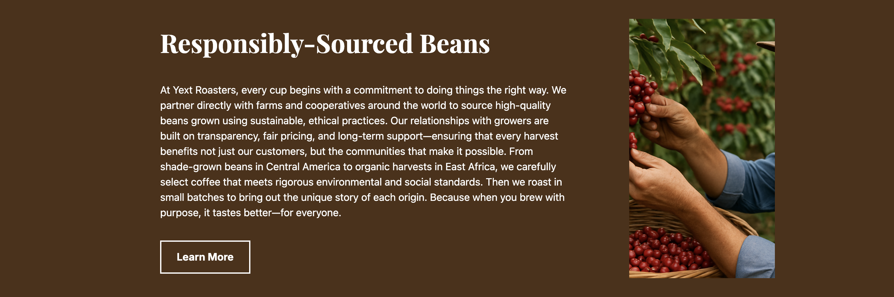

The Promo Section is a flexible content component designed to highlight a single, specific promotion. It combines an image with a title, description, and a call-to-action button in a customizable, split-column layout, making it perfect for drawing attention to special offers or announcements.

Avaliable on Location templates.

---

### Props

The component's props are organized into categories for data, styling, and visibility.

#### Data Props

This object contains the content to be displayed by the component.

| Prop         | Type                    | Description                                                                                           | Default                                       |
| :----------- | :---------------------- | :---------------------------------------------------------------------------------------------------- | :-------------------------------------------- |
| `data.promo` | `YextStructEntityField` | The source for the promotional content, including an image, title, description, and a call-to-action. | Placeholder content for a featured promotion. |

#### Style Props

This object contains properties for customizing the component's appearance.

| Prop                     | Type                                                           | Description                                                   | Default                 |
| :----------------------- | :------------------------------------------------------------- | :------------------------------------------------------------ | :---------------------- |
| `styles.backgroundColor` | [`backgroundColor`](../utils/README.md#backgroundColorOptions) | The background color for the entire section.                  | `Background Color 1`    |
| `styles.orientation`     | `'left' \| 'right'`                                            | Positions the image to the left or right of the text content. | `'left'`                |
| `styles.ctaVariant`      | [`ctaVariant`](../utils/README.md#ctaVariantOptions)           | The visual style variant for the call-to-action button.       | `'primary'`             |
| `styles.heading.level`   | [`headingLevel`](../utils/README.md#headingLevelOptions)       | The HTML heading level for the promo's title.                 | `2`                     |
| `styles.heading.align`   | `'left' \| 'center' \| 'right'`                                | The text alignment for the promo's title and description.     | `'left'`                |
| `styles.image`           | `object`                                                       | Styling options for the promo image, such as aspect ratio.    | `{ aspectRatio: 1.78 }` |

#### Visibility Props

This property controls the component's visibility on the live page.

| Prop             | Type                 | Description                                                                    | Default |
| :--------------- | :------------------- | :----------------------------------------------------------------------------- | :------ |
| `liveVisibility` | `boolean` (optional) | If `true`, the component is visible on the live page; if `false`, it's hidden. | `true`  |

## Static Map Section

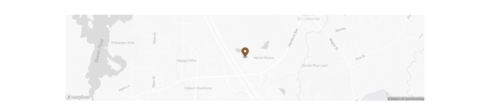

The Static Map Section displays a non-interactive map image of a business's location. It uses the entity's address or coordinates to generate the map and requires a valid API key from mapbox.

Avaliable on Location templates.

---

### Props

The component's props are organized into categories for data and visibility.

#### Data Props

This object contains the configuration needed to generate the map.

| Prop          | Type     | Description                                 | Default             |
| :------------ | :------- | :------------------------------------------ | :------------------ |
| `data.apiKey` | `string` | The API key used to generate the map image. | `""` (empty string) |

#### Visibility Props

This property controls the component's visibility on the live page.

| Prop             | Type      | Description                                                                    | Default |
| :--------------- | :-------- | :----------------------------------------------------------------------------- | :------ |
| `liveVisibility` | `boolean` | If `true`, the component is visible on the live page; if `false`, it's hidden. | `true`  |

## Team Section

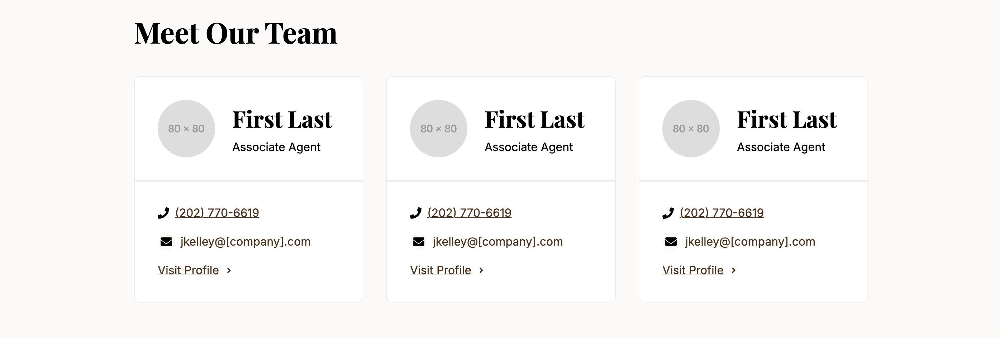

The Team Section is designed to showcase a list of people, such as employees, executives, or other team members. It features a main section heading and renders each person's information—typically a photo, name, and title—as an individual card.

Avaliable on Location templates.

---

### Props

The component's props are organized into categories for data, styling, and visibility.

#### Data Props

This object contains the content to be displayed by the component.

| Prop           | Type              | Description                                                                                        | Default                         |
| :------------- | :---------------- | :------------------------------------------------------------------------------------------------- | :------------------------------ |
| `data.heading` | `YextEntityField` | The main heading for the entire team section.                                                      | `"Meet Our Team"` (constant)    |
| `data.people`  | `YextEntityField` | The source of the team member data, which can be linked to a Yext field or provided as a constant. | A list of 3 placeholder people. |

#### Style Props

This object contains properties for customizing the component's appearance.

| Prop                           | Type                                                           | Description                                                               | Default              |
| :----------------------------- | :------------------------------------------------------------- | :------------------------------------------------------------------------ | :------------------- |
| `styles.backgroundColor`       | [`backgroundColor`](../utils/README.md#backgroundColorOptions) | The background color for the entire section.                              | `Background Color 3` |
| `styles.heading.level`         | [`headingLevel`](../utils/README.md#headingLevelOptions)       | The HTML heading level (e.g., `2` for `<h2>`) for the main section title. | `2`                  |
| `styles.heading.align`         | `'left' \| 'center' \| 'right'`                                | The text alignment for the main section heading.                          | `'left'`             |
| `styles.cards.headingLevel`    | [`headingLevel`](../utils/README.md#headingLevelOptions)       | The HTML heading level for the name on each individual person card.       | `3`                  |
| `styles.cards.backgroundColor` | [`backgroundColor`](../utils/README.md#backgroundColorOptions) | The background color for each individual person card.                     | `Background Color 1` |

#### Visibility Props

This property controls the component's visibility on the live page.

| Prop             | Type      | Description                                                                    | Default |
| :--------------- | :-------- | :----------------------------------------------------------------------------- | :------ |
| `liveVisibility` | `boolean` | If `true`, the component is visible on the live page; if `false`, it's hidden. | `true`  |

## Testimonial Section

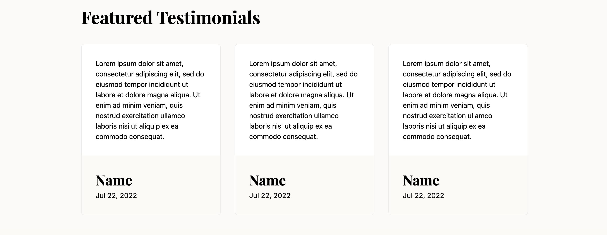

The Testimonial Section is used to display a list of customer testimonials or reviews. It features a main section heading and renders each testimonial as an individual card, providing social proof and building trust with visitors.

Avaliable on Location templates.

---

### Props

The component's props are organized into categories for data, styling, and visibility.

#### Data Props

This object contains the content to be displayed by the component.

| Prop                | Type              | Description                                                                                        | Default                               |
| :------------------ | :---------------- | :------------------------------------------------------------------------------------------------- | :------------------------------------ |
| `data.heading`      | `YextEntityField` | The main heading for the entire testimonials section.                                              | `"Featured Testimonials"` (constant)  |
| `data.testimonials` | `YextEntityField` | The source of the testimonial data, which can be linked to a Yext field or provided as a constant. | A list of 3 placeholder testimonials. |

#### Style Props

This object contains properties for customizing the component's appearance.

| Prop                           | Type                                                           | Description                                                                       | Default              |
| :----------------------------- | :------------------------------------------------------------- | :-------------------------------------------------------------------------------- | :------------------- |
| `styles.backgroundColor`       | [`backgroundColor`](../utils/README.md#backgroundColorOptions) | The background color for the entire section, selected from the theme.             | `Background Color 2` |
| `styles.heading.level`         | [`headingLevel`](../utils/README.md#headingLevelOptions)       | The HTML heading level (e.g., `2` for `<h2>`) for the main section title.         | `2`                  |
| `styles.heading.align`         | `'left' \| 'center' \| 'right'`                                | The text alignment for the main section heading.                                  | `'left'`             |
| `styles.cards.headingLevel`    | [`headingLevel`](../utils/README.md#headingLevelOptions)       | The HTML heading level for the author's name on each individual testimonial card. | `3`                  |
| `styles.cards.backgroundColor` | [`backgroundColor`](../utils/README.md#backgroundColorOptions) | The background color for each individual testimonial card.                        | `Background Color 1` |

#### Visibility Props

This property controls the component's visibility on the live page.

| Prop             | Type      | Description                                                                    | Default |
| :--------------- | :-------- | :----------------------------------------------------------------------------- | :------ |
| `liveVisibility` | `boolean` | If `true`, the component is visible on the live page; if `false`, it's hidden. | `true`  |
